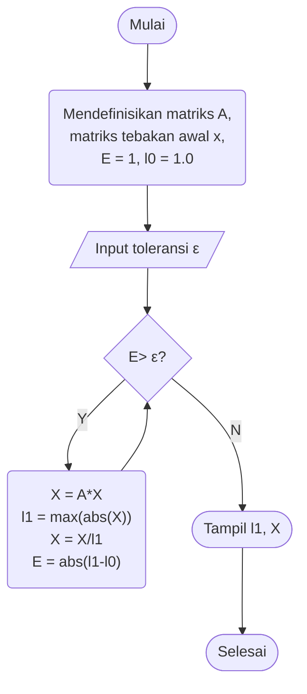
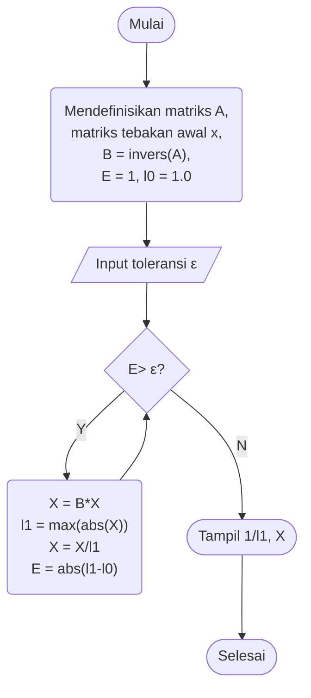

# KN-M4
# Metode Pangkat



# Metode Pangkat Inversi



# Gauss-Jordan Inverse
```
1. Start 

2. Read Order of Matrix (n).

3. Read Matrix (A):

	For i = 1 to n
	  For j = 1 to n
	    Read Ai,j
	  Next j
	Next i

4. Augment Identity Matrix of Order n to Matrix A:

	For i = 1 to n
	  For j = 1 to n
	    
	    If i = j
	      Ai,j+n = 1
	    Else
	      Ai,j+n = 0
	    End If
	  
	  Next j
	Next i

5. Apply Gauss Jordan Elimination on Augmented Matrix (A):
	For i = 1 to n
	  If Ai,i = 0
	    Print "Mathematical Error!"
	    Stop
	  End If
	  
	  For j = 1 to n
	    If i ≠ j
	      Ratio = Aj,i/Ai,i
	      
	      For k = 1 to 2*n
	        Aj,k = Aj,k - Ratio * Ai,k
	      Next k
	    
	    End If
	  Next j
	Next i
	
6. Row Operation to Convert Principal Diagonal to 1.
	
	For i = 1 to n
	  For j = n+1 to 2*n
	    Ai,j = Ai,j/Ai,i
	  Next j
	Next i
	
7. Display Inverse Matrix:

	For i = 1 to n
	  For j = n+1 to 2*n
	    Print Ai,j
	  Next j
	Next i

8. Stop

---------------
Note: All array indexes are assumed to start from 1.
```
