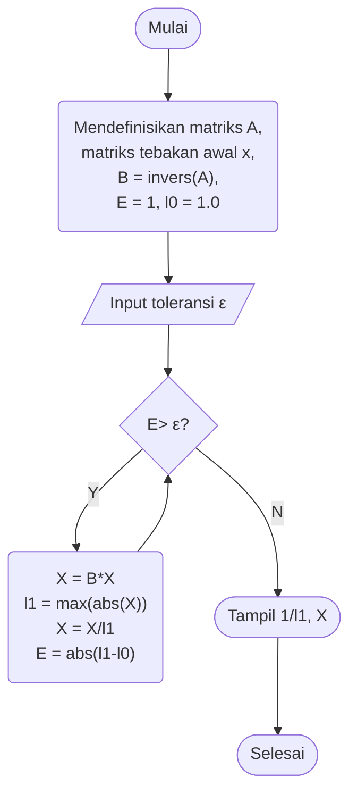

# KN-M4
# Metode Pangkat

```mermaid
graph TD;
    A([Mulai])-->B(Mendefinisikan matriks A,<br/>matriks tebakan awal x,<br/>E = 1, l0 = 1.0);
    B-->C[/Input toleransi ε/];
    C-->D{E> ε?};
    D--Y-->E("X = A*X<br/>l1 = max(abs(X))<br/>X = X/l1<br/>E = abs(l1-l0)");
    E-->D;
    D--N-->O([Tampil l1, X]);
    O-->P([Selesai]);
```

# Metode Pangkat Inversi

```mermaid
graph TD;
    A([Mulai])-->B("Mendefinisikan matriks A,<br/>matriks tebakan awal x,<br/>B = invers(A),<br/>E = 1, l0 = 1.0");
    B-->C[/Input toleransi ε/];
    C-->D{E> ε?};
    D--Y-->E("X = B*X<br/>l1 = max(abs(X))<br/>X = X/l1<br/>E = abs(l1-l0)");
    E-->D;
    D--N-->O([Tampil 1/l1, X]);
    O-->P([Selesai]);
```
